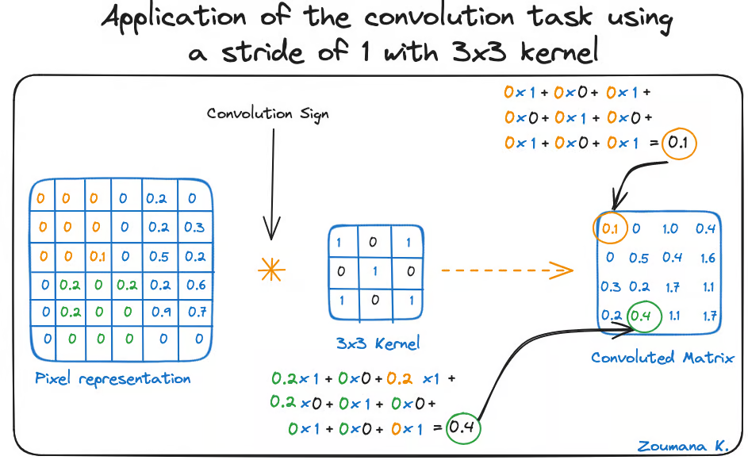

# RCNN + CTC loss
## CNN(Convolutional Neural Network)
- Mạng CNN mô phỏng cách mà não người hoạt động để nhận diện các mẫu và đặc trưng trong hình ảnh.
- Mạng CNN gồm 4 phần sau:  
    + Convolutional layers
    + Rectified Linear Unit 
    + Pooling layers
    + Fully connected layers
- Input: Giả sử sẽ biểu diễn hình ảnh sang một ma trận pixel 

    

### Convolutional layers:  Tích chập
- Bước này dùng để trích các đặc trưng của ảnh. 
- Ở bước này sử dụng phép tích chập (convolution), đó là việc áp dụng một hàm cửa sổ trượt lên một ma trận điểm ảnh biểu diễn hình ảnh. Hàm trượt áp dụng lên ma trận này được gọi là kernel (bộ lọc nhân) hoặc filter (bộ lọc).
- Giả sử: 
    + Input là một ma trận I kích thước H x W 
    + Kernel(Filter) là một ma trận K 
    + Kết quả là ma trận O.
    + Với padding = 0 và stride = 1: ta có công thức:

    
**Lưu ý: Có thể mở rộng với padding > 0 và stride > 1**

- Trong tầng tích chập, sẽ có nhiều kernel được áp dụng, mỗi kernel sẽ có nhiệm vụ nhận biết các đặc trựng khác nhau(chữ số, cạnh,...) 

    

### Activation function(ReLU) - Hàm kích hoạt
- Tạo sự phi tuyến cho mô hình. Từ đó sẽ ẩn đi những chi tiết không cần thiết để mô hình chỉ học được những thứ đặc trưng của hình ảnh.

    

#### Rectified Linear Unit(ReLU)

- Công thức hàm Relu như sau: f(x)=max(0,x)

- Giả sử ảnh một con mèo, và một lớp tích chập:
    + Nếu không có ReLU, tất cả pixel sau tích chập vẫn là các giá trị dương, âm hoặc nhỏ xíu → không rõ mẫu.
    + Nhờ ReLU, tất cả giá trị âm (không quan trọng) bị loại bỏ, còn phần dương (có thể là râu, mắt, tai...) được giữ lại → mạng dễ học được đặc trưng quan trọng.

### Pooling layer
- Mục đích chính của lớp pooling là lấy ra những đặc trưng quan trọng nhất từ ma trận đặc trưng đã được convolution xử lý.
- Pooling layer gồm 3 loại:
    + Max pooling: Chọn giá trị lớn nhất làm nổi bật đặc trưng có cường độ mạnh nhất.
    + Sum pooling: Tính tổng tất cả các giá trị trong vùng cửa sổ pooling, tổng hợp cường độ tín hiệu.
    + Average pooling: Tính trung bình các giá trị trong vùng cửa sổ pooling.

- Áp dụng Max pooling với kernel 2x2, Stride = 2, Padding = 0

    

### Fully connected layers
- Sau khi ảnh được truyền qua nhiều convolutional layer và pooling layer thì model đã học được tương đối các đặc điểm của ảnh (ví dụ mắt, mũi, khung mặt,…) thì tensor của output của layer cuối cùng, kích thước H x W x D, sẽ được chuyển về 1 vector kích thước (H x W x D)

    

## RNN - recurrent neural network

- Trong RNN, thông tin được truyền qua một vòng lặp, vì vậy đầu ra được xác định bởi đầu vào hiện tại và các đầu vào đã nhận trước đó.
- Các neuron này được tổ chức thành:
    + Lớp đầu vào (input layer)
    + Lớp ẩn (hidden layer) 
    + Lớp đầu ra (output layer).

    

- Cho tập input x = [h,e,l,o], sử dụng mô hình RNN để tạo ra một từ có nghĩa. 

    

## CTC  - Connectionist Temporal Classification

- CTC là một thuật toán được sử dụng để đào tạo mạng nơ-ron sâu trong các tác vụ không có liên kết rõ ràng của đầu vào và đầu ra.
    + Ví dụ: nhận diện chữ viết tay và nhận diện giọng nói...
- CTC sinh ra để giải quyết bài toán trình tự đầu vào và trình tự mục tiêu có thể không có sự tương ứng một-một.
    + Ví dụ: hello và helloooooo...

- Biểu diễn toán học, hãy xem xét các dãy đầu vào *X = [X1, X2, X3... Xm}* và các chuỗi đầu ra *Y = [Y1, Y2 ..., Yn]*. Nếu muốn ánh xạ x thành y, có các vấn đề sau:
 
    + Chiều dài của X (m) và chiều dài của Y (n) là khác nhau.
    + Tỷ lệ chiều dài là X và Y sẽ khác nhau.
    + X và Y không có sự liên kết.
- Ví dụ:
    + Chuỗi đầu vào X: X=[x1,x2,...,x10] -  tương ứng với 10 khung âm thanh.
    + Chuỗi đầu ra Y: Y=[h,e,l,l,o] → hello
- Vấn đề: 
    + Không biết tại bước thời gian nào ký tự "h", "e", "l", "l", "o" xảy ra. 
    + Người nói nhanh thì "h" chỉ chiếm 1 frame, người khác thì kéo dài "e" thành 3 frames. Việc căn chỉnh này khác nhau ở mỗi người.

- **CTC giải quyết**:
    + Sinh ra một chuỗi các nhãn tạm thời
    + Sử dụng một thuật toán để thu hẹp chuỗi này thành kết quả cuối cùng bằng cách:
        + Loại bỏ các ký tự lặp lại liên tiếp.
        + Bỏ các ký tự đặc biệt như "blank".

    

## RCNN + CTC loss
- Nhận dạng kí tự (OCR) về cơ bản là bài toán nhận dạng chuỗi dựa trên hình ảnh đầu vào.
- Vấn đề nhận dạng trình tự thì mạng nơ ron phù hợp nhất là recurrent neural networks(RNN) trong khi đó đối với các vấn đề về hình ảnh thì mạng nơ ron phù hợp nhất là convolution neural networks(CNN).
- Để giải quyết các vấn đề về OCR thì đưa ra giải pháp kết hợp CNN và RNN.

    

### Convolutional Layers
- Ảnh đầu vào được cho đi qua các lớp Conv, sinh ra các Feature Maps. Các Feature Maps sau đó lại được chia ra thành một chuỗi của các Feature Vectors (các TimeSteps), gọi là Feature Sequence.
- Giả sử:
    + Ảnh đầu vào: (32 × 128) (cao 32, rộng 128)
    + Sau Conv → Feature Maps: (64 × 8 × 32)
    + 32 bước thời gian (32 cột)
    + Mỗi bước là một vector có kích thước: (64 × 8) = 512 chiều

    =>Tạo thành Feature Sequence: tạo 32 vector có kích thước 512 chiều.

    

### Recurrent Layers
- Feature Sequence được đưa vào các lớp Bidirectional LSTM, sinh ra một chuỗi các ký tự (Seq2Seq), mà mỗi một ký tự tương ứng với một TimeStep trong Feature Sequence.

    

### Transcription Layers
- CTC - Nhiệm vụ của phần này là xử lý đầu ra của Recurrent Layers, sắp xếp lại các ký tự, loại bỏ các lỗi tồn tại (alignment) để đưa ra kết quả cuối cùng.

    

**Link tham khảo:** https://github.com/TomHuynhSG/Vietnamese-Handwriting-Recognition-OCR